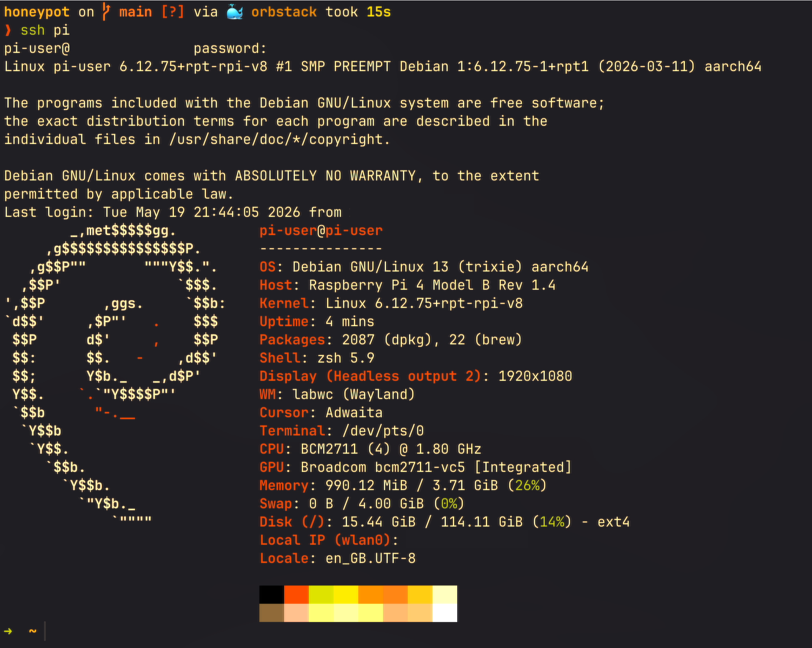

# IoT Honeypot Stack - Raspberry Pi



[](https://github.com/niutaq/honeypot)

---

* ### Table of Contents
    *   [Architecture](#architecture)
    *   [Quick Start](#quick-start)
    *   [Attack Scenarios](#attack-scenarios)
    *   [Monitoring and Analysis](#monitoring-and-analysis)
    *   [Troubleshooting](#troubleshooting)
    *   [Legal Notice](#legal-notice)
---

A Raspberry Pi honeypot demo stack for a controlled academic attack scenario. It collects and visualizes attacks against SSH/Telnet, FTP, HTTP, MySQL, VNC, and a public fake web page exposed through Tailscale Serve/Funnel.

This project is intended for controlled academic scenarios. Do not use real credentials. Attackers should use only test passwords from rockyou_small.txt.

### Architecture

Services:

| Service | Role | Port |
| :--- | :--- | :--- |
| cowrie | SSH/Telnet honeypot | 2222, 2223 |
| opencanary | FTP/HTTP/MySQL/VNC honeypot | 21, 8082, 3306, 5900 |
| decoy-web | Fake NGINX web page | 80 |
| loki | Log aggregation | 3100 |
| promtail | Log shipper | no port |
| grafana | SIEM dashboard | 3000 |
| uptime-kuma | Service monitoring | 3001 |
| ngrok | Public tunnel fallback | ngrok profile |

### Web & Ingestion Flow

1. **Inbound Traffic:**  
   `Attacker` ➔ `Tailscale Funnel (Public URL)` ➔ `RPi:80 (decoy-web / NGINX)`
2. **Honeypot Trap:**  
   `decoy-web` ➔ Proxies `/login` requests ➔ `OpenCanary:8080`
3. **Log Aggregation Pipeline:**  
   * `NGINX JSON Log` (`logs/nginx/access.log`)  
   * `OpenCanary Log` (`logs/opencanary/opencanary.log`)  
   └──► **`Promtail`** ➔ **`Loki`** ➔ **`Grafana SIEM Dashboard`**

### Quick Start

On the Raspberry Pi:
```bash
cd ~/honeypot
docker compose up -d
docker compose ps
```

Grafana Panel:
http://pi-user.local:3000 (admin/admin)

### Attack Scenarios

1. Attacker - Browser:
Open the public URL and enter test passwords (admin, student, test123). The form posts to /login.

2. Attacker - curl:
```bash
curl -k "$PUBLIC_URL/.env"
curl -k -X POST "$PUBLIC_URL/login" -d "username=admin&password=test123"
```

3. Attacker - Hydra HTTP POST:
```bash
hydra -I -l admin -P rockyou_small.txt -s 443 <HOST> https-post-form "/login:username=^USER^&password=^PASS^:Invalid"
```

4. Attacker - SSH Cowrie:
```bash
ssh root@<IP_RPI> -p 2222
```

### Monitoring and Analysis

Dashboard: Honeypot IoT Security Dashboard
- Live Attack Logs: Raw events.
- Top Attacked Web Paths: Most requested URLs.
- Web Login Attempts: Captured credentials.
- Attacker User-Agents: Identification of attacker tools.

### Troubleshooting

If Grafana shows "No data":
1. Check NGINX logs: tail -n 20 logs/nginx/access.log
2. Check container status: docker compose ps
3. Check container logs: docker compose logs --tail=50 promtail
4. Recreate the stack: docker compose up -d --force-recreate

---

## Legal Notice

For educational purposes only. Do not use for monitoring real systems without authorization.
